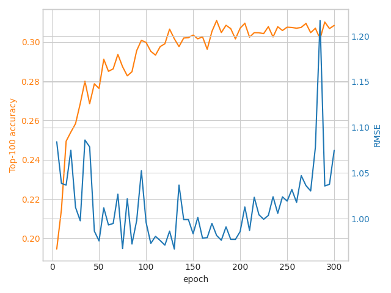

# Final Solution Report: DCN

## Introduction
This solution is based on the [TensorFlow Recommenders (TFRS)](https://www.tensorflow.org/recommenders)
library.
Some functions or parts of code could be adapted from [TensorFlow examples](https://www.tensorflow.org/recommenders/examples/quickstart).

## Data analysis
The MovieLens dataset is a classic dataset from the [GroupLens](https://grouplens.org/datasets/movielens/)
research group at the University of Minnesota.
It contains a set of ratings given to movies by a set of users.

Instead of the dataset provided in the assignment, [TensorFlow Datasets movielens](https://www.tensorflow.org/datasets/catalog/movielens)
was used, which is exactly the same dataset but in more convenient format.

It was decided to use the following features in this solution:
- `user_id:` - identify user
- `movie_title` - identify movie and extract text features
- `user_gender` - embed gender
- `bucketized_user_age` - embed age
- `user_occupation_text` - embed occupation
- `user_zip_code` - embed geo data
- `timestamp` - embed time
- `user_rating` - used to train rating model

## Model architecture
*Model implementation could be found in
[2.0-training-and-visualization.ipynb](../notebooks/2.0-training-and-visualization.ipynb)*

Model in this project is
*multitask (retrieval and rating) [Deep & Cross Network (DCN)](https://arxiv.org/pdf/2008.13535.pdf)*
(further simply **combined model**).

**DCN** consists of 2 main parts:
1. Embed **User** and **Movie** features (further referred as **Query** and **Candidate**)
2. Combine embeddings to compute affinity score and predict rating.

Let's describe those steps in more details.

### Query model
A total of 6 features were embedded in **Query model** and each embedding
here has a size of `int(vocab_size ** 0.25)`.

Next, those embeddings and a normalized timestamp are concatenated
and an embedding vector obtained:
```python
return tf.concat([
    self.user_embedding(inputs["user_id"]),
    self.timestamp_embedding(inputs["timestamp"]),
    tf.reshape(self.normalized_timestamp(inputs["timestamp"]), (-1, 1)),
    self.occupation_embedding(inputs["user_occupation_text"]),
    self.zipcode_embedding(inputs["user_zip_code"]),
    self.gender_embedding(inputs["user_gender"]),
    self.age_embedding(inputs["bucketized_user_age"]),
], axis=1)
```
Finally, that embedding is passed through a small stacked DCN:


### Candidate model
`movie_title` feature is embedded in **Candidate model**.
This feature is split into 2 embeddings (simple lookup and text embedding):
```python
self.title_embedding = tf.keras.Sequential([
    tf.keras.layers.StringLookup(
      vocabulary=unique_movie_titles,mask_token=None),
    tf.keras.layers.Embedding(len(unique_movie_titles) + 1, 32)
])

self.title_vectorizer = tf.keras.layers.TextVectorization(max_tokens=max_tokens)

self.title_text_embedding = tf.keras.Sequential([
    self.title_vectorizer,
    tf.keras.layers.Embedding(max_tokens, 32, mask_zero=True),
    tf.keras.layers.GlobalAveragePooling1D(),
])
```
Next, those embeddings are concatenated and an embedding vector obtained:
```python
return tf.concat([
    self.title_embedding(titles),
    self.title_text_embedding(titles),
], axis=1)
```
Finally, that embedding is passed through a small stacked DCN:


### Combined model
Now when we have **Query** and **Candidate** embeddings we can do retrieval and
rating tasks:
```python
self.rating_task = tfrs.tasks.Ranking(
    loss=tf.keras.losses.MeanSquaredError(),
    metrics=[tf.keras.metrics.RootMeanSquaredError()],
)
self.retrieval_task = tfrs.tasks.Retrieval(
    metrics=tfrs.metrics.FactorizedTopK(
        candidates=movies.batch(128).map(self.candidate_model),
    ),
)
```

Whilst computing retrieval loss is pretty straightforward:
```python
retrieval_loss = self.retrieval_task(query_embeddings, candidate_embeddings)
```
Computing rating loss requires additional actions.
First, we concatenate **Query** and **Candidate** embeddings:
```python
x = tf.concat([query_embeddings, candidate_embeddings], axis=1)
```

Then we pass `x` through the following Deep Neural Network (DNN):


And finally we can calculate the rating loss:
```python
rating_loss = self.rating_task(
    labels=ratings,
    predictions=rating_predictions,
)
```

Now, to accomplish both of the tasks weights are assigned to losses:
```python
# And combine them using the loss weights.
return (self.rating_weight * rating_loss + self.retrieval_weight * retrieval_loss)
```

## Model Advantages and Disadvantages
### Advantages
- Low RMSE
- High factorized accuracy
- Interpretability - weights of DCN networks in **Query** and **Candidate** models
could reveal features importance. (Not implemented)
### Disadvantages
- Slow inference (indexing could fix that)

## Training Process
*Training process could be found in
[2.0-training-and-visualization.ipynb](../notebooks/2.0-training-and-visualization.ipynb)*

Dataset was split into train - 80% and test - 20%.
Training took a total of 300 epochs and ~1 hour to train (Laptop RTX 3060) with validation every 5 epochs.

Here is a graph with validation metrics:



## Evaluation
*Code implementation is located in [evaluate.py](../benchmark/evaluate.py)*

Running evaluation on the validation dataset gave the following results:
```shell
RMSE:                   0.9815
Factorized top 10:      0.016300
Factorized top 50:      0.148750
Factorized top 100:     0.310900
```
*[Factorized Top-k reference](https://sefidian.com/2022/04/30/understanding-factorized-top-k-factorizedtopk-metric-for-recommendation-systems-with-example/)*

Also, [MAP@K and MAR@K](http://sdsawtelle.github.io/blog/output/mean-average-precision-MAP-for-recommender-systems.html) are available in [4.0-recmetrics](../notebooks/4.0-recmterics.ipynb),
which is implemented using [recmetrics](https://github.com/statisticianinstilettos/recmetrics) package:
```shell
MAP@1:	0.006369426751592357
MAR@1:	0.0012060627506487378
MAP@5:	0.006340233545647558
MAR@5:	0.0034913429306858796
MAP@10:	0.0077628714161610225
MAR@10:	0.00620951802509859
```

## Results
There is still work to do, such as optimizing model initialization and inference.
I also believe that it's possible to enhance model performance with better fine-tuning and feature extracting.

However, model is already fully operational and performs both retrieval and rating tasks
successfully.
